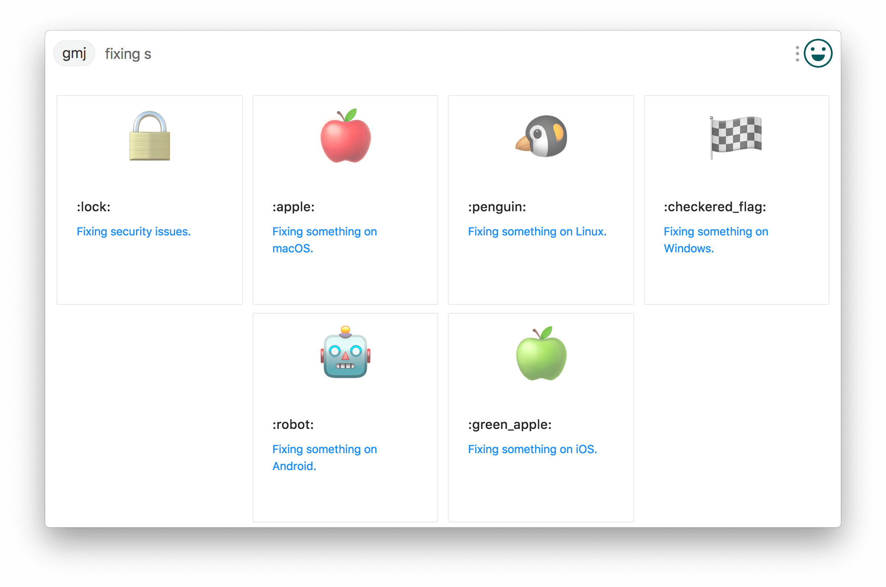

## utools-plugin-gitmoji

-rgb(118,159,213).svg)

Demo 向

基于 [`umijs`](https://github.com/umijs/umi) + `TypeScript` + [`antd`](https://ant.design)  构建的 [`uTools`](https://u.tools) 插件

[gitmoji](https://gitmoji.carloscuesta.me/) 在你的 commit 中添加 emoji。

单击图标复制 gitmoji code, 黏贴到你的 commit 信息中。[下载](https://github.com/kyuuseiryuu/utools-plugin-gitmoji/releases)

